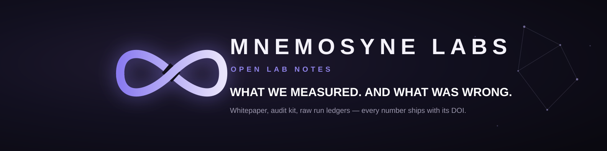

  

### Everyone is building the intelligence. We build the relationship.

*The memory that makes an AI actually know you, across sessions and across years.*
*On your machine. Yours to read.*

 

 

 

---

## Start here

| | | |
|---|---|---|
| 💿 **Use it** | Install the desktop OS, point it at your files, add cartridges from the built-in store. Windows, macOS, Linux. | [**Download v1.4.2**](https://github.com/Mnemosyne-OS/Mnemosyne-Neural-OS/releases/latest) · [User guide](https://docs.mnemosyne-os.io) |
| 🛠️ **Build on it** | The MnemoForge CLI, the developer SDKs, and seven cartridges whose full source sits in this organization. | [**The SDK**](https://github.com/Mnemosyne-OS/Mnemosyne-Neural-OS) · [Packages](https://mnemosyne-os.io/packages) |
| 🔬 **Check the claim** | 77.1% on LongMemEval-M under a strict judge, published with every question, every retrieved chunk and every verdict. | [**Open the verification kit**](https://mnemosyne-os.github.io/MnemosyneOS---benchmarks/verification-kit/) |

 

  

---

## What it is, in one paragraph

Mem0, Zep and Letta hand *an agent* a memory service you wire into a cloud stack.
Mnemosyne OS is a desktop application, and the customer is you. It installs on your
machine, reads the files and conversations you point it at, and keeps them as durable,
searchable memory that any model you connect can draw on. Nothing is uploaded to run
it. Vaults partition memory by domain so nothing bleeds between them, retrieval ranks
your vault twice (by meaning and by exact words) and fuses the two rankings, a
navigable neural map shows what connects to what, and a dream state revisits old
material while you are away and writes down what it noticed. Encryption at rest is
there, armed by you. A human decides what is remembered, what is surfaced, and what is
forgotten.

**[→ The full tour, in the repository README](https://github.com/Mnemosyne-OS/Mnemosyne-Neural-OS#readme)**

---

## Everything in this organization

### 💿 The OS and the SDK

| Repository | What lives there |
|---|---|
| **[Mnemosyne-Neural-OS](https://github.com/Mnemosyne-OS/Mnemosyne-Neural-OS)** | The desktop app: documentation, the MnemoForge CLI, the developer SDKs, and every signed release for the three platforms. |

### 🧩 The cartridges

Small apps that run *inside* the OS and share its memory. One click from MnemoHub, the
built-in store. Each one is a worked example of the SDK as much as a tool.

| Cartridge | What it does |
|---|---|
| **[Muse](https://github.com/Mnemosyne-OS/Muse)** | Neural coding. Describe an app in plain words, Muse frames it with you, designs it, scaffolds a real project on disk and hands it to your IDE agent, grounded in your memory. |
| **[MnemoReader](https://github.com/Mnemosyne-OS/MnemoReader---MnemosyneOS)** | A living PDF library that reads aloud. Drop in a folder, it extracts, remembers, and follows the text word by word. |
| **[MnemoArchipel](https://github.com/Mnemosyne-OS/MnemoArchipel---Mnemosyne-OS)** | A sovereign personal CRM. The people in your life, mapped on your own machine. |
| **[MnemoResto](https://github.com/Mnemosyne-OS/MnemoResto---MnemosyneOS)** | The restaurant that forgets no guest: floor plan, reservations, guest history, register. |
| **[Oikos](https://github.com/Mnemosyne-OS/Oikos)** | Your Home Assistant, read into your memory. Sensors, cameras, and a searchable archive of stills. Read only, local network only. |
| **[Translator](https://github.com/Mnemosyne-OS/mnemosyne_OS-translator)** | Batch translation of text and Markdown under your own API key. |
| **[BMAD](https://github.com/Mnemosyne-OS/mnemosyne_OS-bmad)** | A wizard that turns an idea into a structured project blueprint. |

Oikos, MnemoReader and Translator are MIT. The other four carry the Mnemosyne cartridge
licence: read the source, adapt it for yourself, run it inside the OS. The surfaces you
extend are open, the memory engine is sealed.

### 🔬 The proof

| Repository | What lives there |
|---|---|
| **[MnemosyneOS---benchmarks](https://github.com/Mnemosyne-OS/MnemosyneOS---benchmarks)** | The benchmark campaigns published whole: methodology, per-question verdicts, raw run logs, and a kit that re-derives every score in front of you. CC BY 4.0. |

### 🌐 The pages

| Repository | What lives there |
|---|---|
| **[mnemosyne-os.github.io](https://github.com/Mnemosyne-OS/mnemosyne-os.github.io)** | The organization on GitHub Pages: the product, the documentation, the open packages. |
| **[.github](https://github.com/Mnemosyne-OS/.github)** | This page. |

---

## 🫀 Psyche, the soul engine

Memory is half of the relationship. Psyche is the other half: a persistent personality
for your AI, character, voice and identity, forged by you in a guided ritual and
carried across conversations and across models. Change vendors, it comes with you.

Psyche ships inside Mnemosyne OS today. A standalone forge, for any agent anywhere, is
next.

**[→ psyche.mnemosyne-os.io](https://psyche.mnemosyne-os.io)**

---

## 🔬 A number you do not have to take on faith

Mnemosyne OS scores **77.1% on LongMemEval-M**, full-haystack, around 480 distractor
sessions per question, the variant nobody cites. That figure comes from a **strict**
judge, measured twice, verdict for verdict, and confirmed on 48 held-out questions with
zero retrieval regressions.

Under the **flexible** judge we used in July, the same build measures **81.3%**, and
July's own published floor of **72.9%** stays archived and citable exactly as it went
out. Two graders are two instruments, so their scores are reported side by side and
never chained into a progression. A number we improved on is not a number we delete.

Anyone can publish a percentage. We publish the ledger underneath it: every question,
every retrieved chunk, every judgement, plus a script that re-derives each score from
those raw results.

**[→ Open the verification kit](https://mnemosyne-os.github.io/MnemosyneOS---benchmarks/verification-kit/)** · **[→ The August raw runs](https://github.com/Mnemosyne-OS/MnemosyneOS---benchmarks/tree/main/lexical-2026-08)**

---

## 🧪 The Lab

Research is published whole, with permanent identifiers, including the hypotheses that
failed.

| Publication | |
|---|---|
| **The Resonance Engine**: *a multi-engine cognitive memory architecture for sovereign AI systems.* Whitepaper v2.1, CC BY 4.0. |  |
| **LongMemEval-M full-haystack verification kit**: *per-question ledgers and audit scripts.* CC BY 4.0 and MIT. |  |
| **Lab notes**: what we measured, and what was wrong. |  |
| **Author record**: the ORCID behind the deposits. |  |

---

## 📍 Where the project lives

Published by **XPACEGEMS LLC**. These are its official addresses.

| | |
|---|---|
| **Product** | [mnemosyne-os.io](https://mnemosyne-os.io) |
| **Company, press and labs** | [mnemosyne-os.com](https://mnemosyne-os.com) |
| **Documentation** | [docs.mnemosyne-os.io](https://docs.mnemosyne-os.io) |
| **Soul engine** | [psyche.mnemosyne-os.io](https://psyche.mnemosyne-os.io) |
| **Source and releases** | this organization |
| **Packages** | the npm scope `@mnemosyne_os`, [the list](https://mnemosyne-os.io/packages) |
| **Contact** | [dev@mnemosyne-os.io](mailto:dev@mnemosyne-os.io) |

---

## ✍️ From the blog

The stories behind the numbers, on [the blog](https://mnemosyne-os.io/blog):
**[A multiplier cannot rescue a zero](https://mnemosyne-os.io/blog/a-multiplier-cannot-rescue-a-zero)** ·
**[72.9% and the three questions we miss](https://mnemosyne-os.io/blog/full-haystack-72-9)** ·
**[We gave personality control of memory. It cost 31 points.](https://mnemosyne-os.io/blog/personality-lens-31-points)** ·
**[Present is not the same as loadable](https://mnemosyne-os.io/blog/a-release-that-could-not-load-a-model)** ·
**[The memory my brain kept asking for](https://mnemosyne-os.io/blog/la-memoire-que-mon-cerveau-reclamait)**

---

  

**[mnemosyne-os.io](https://mnemosyne-os.io)** · **[psyche.mnemosyne-os.io](https://psyche.mnemosyne-os.io)** · **[mnemosyne-os.com](https://mnemosyne-os.com)** · **[docs.mnemosyne-os.io](https://docs.mnemosyne-os.io)**

Memory perceives, situates and reveals. The human governs.

