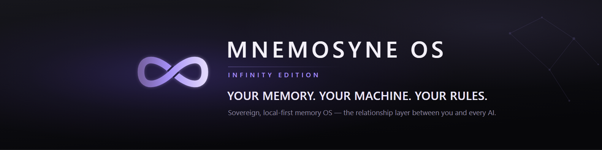
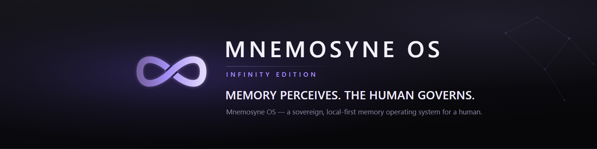

  

*Everyone is building the intelligence.*
*We build the **relationship** — the memory that makes an AI actually know you,*
*across sessions and across years. On your machine. Yours to read.*

 

 

 

---

## Not one app — an ecosystem

Mnemosyne OS began as a desktop application. It has grown into a family of things that
all stand on the same ground: **your memory, kept on your machine, governed by you.**

| | Pillar | What it is |
|---|---|---|
| 💿 | **The OS** | *Infinity Edition* — the desktop app. Vaults, semantic retrieval, a navigable neural map, local voice, and a dream state that consolidates while you are away. |
| 🧩 | **The cartridges** | Small apps that run *inside* the OS and share its memory — a PDF library that reads aloud, a personal CRM, a coding studio, a restaurant book. Installed in one click from **MnemoHub**, the built-in store. |
| 🛠️ | **The SDK** | The MnemoForge CLI and developer SDKs. Every cartridge in this organization is a worked, open-source example of what you can build. |
| 🫀 | **Psyche** | The soul engine — a persistent personality for your AI, forged by you in a guided ritual, portable across models. |
| 🔬 | **The proof** | Benchmark campaigns published whole: methodology, raw run logs, and a kit that lets anyone audit the score. |

 

  

---

## 💿 The OS — Infinity Edition

Mem0, Zep and Letta hand *an agent* a memory service you wire into a cloud stack.
**Mnemosyne OS is a desktop application, and the customer is you.** It installs on your
machine, reads the files and conversations you point it at, and keeps them as durable,
searchable memory that any model you connect can draw on. Nothing is uploaded to run it.
A human — not a heuristic — decides what is remembered, what is surfaced, and what is
forgotten.

| | |
|---|---|
| 🗄️ **Vaults** | Memory partitioned by domain — code, notes, research, journal. Nothing bleeds between them unless you say so. |
| 📜 **Chronicles** | Every memory keeps its kind and its context, so retrieval returns *why* something mattered, not just a matching string. |
| 🌐 **Neural map** | Your memory as a navigable topology — see what connects to what, instead of trusting a black box. |
| 🌙 **Consolidation** | A dream state that revisits old material while you are away, and writes down what it noticed. |
| 🎙️ **Voice** | Local speech in and out, dispatched to real GPU or CPU so a heavy model never freezes the app. |
| 🧩 **Cartridges** | The apps below, and yours — running inside the OS, sharing its memory. |

**[→ Download Infinity Edition v1.3.6 · The Persona](https://github.com/Mnemosyne-OS/Mnemosyne-Neural-OS/releases/latest)** — Windows x64 (installer or portable) · macOS Apple Silicon · Linux deb/AppImage

The **[Mnemosyne-Neural-OS](https://github.com/Mnemosyne-OS/Mnemosyne-Neural-OS)** repository
holds the documentation, the MnemoForge CLI, the developer SDKs, and every release.

---

## 🧩 The cartridges

Small apps that live inside the OS and share its memory. Each one is open source, and
each one is a worked example of the SDK as much as a tool:

| Cartridge | What it does |
|---|---|
| **[Muse](https://github.com/Mnemosyne-OS/Muse)** | Neural coding. Describe an app in plain words — Muse frames it with you, designs it, scaffolds a real project on disk and hands it to your IDE agent, grounded in your memory. |
| **[MnemoReader](https://github.com/Mnemosyne-OS/MnemoReader---MnemosyneOS)** | A living PDF library that reads aloud. Drop in a folder, it extracts and remembers. |
| **[MnemoArchipel](https://github.com/Mnemosyne-OS/MnemoArchipel---Mnemosyne-OS)** | A sovereign personal CRM — the people in your life, on your machine. |
| **[MnemoResto](https://github.com/Mnemosyne-OS/MnemoResto---MnemosyneOS)** | The restaurant that forgets no guest: floor plan, reservations, guest history. |
| **[Translator](https://github.com/Mnemosyne-OS/mnemosyne_OS-translator)** | Batch translation of text and Markdown under your own API key. |
| **[BMAD](https://github.com/Mnemosyne-OS/mnemosyne_OS-bmad)** | A wizard that turns an idea into a structured project blueprint. |

Open to build on, private at the core: the surfaces you extend are open, the memory
engine is not.

---

## 🫀 Psyche — give your AI a soul

Memory is half of the relationship. **Psyche** is the other half: a soul engine that
forges a persistent personality — character, voice, identity — that survives across
conversations and across models. You shape it in a guided ritual; it lives on your
machine; it travels with you when you change vendors.

Psyche ships inside Mnemosyne OS today. A standalone forge, for any AI agent anywhere,
is next.

**[→ psyche.mnemosyne-os.io](https://psyche.mnemosyne-os.io)**

---

## 🔬 A number you do not have to take on faith

Mnemosyne OS scores **72.9% on LongMemEval-M**.

Anyone can publish a percentage. We publish the ledger underneath it: every question,
every retrieved chunk, every judgement — plus a script that re-derives the score from
those raw results in front of you.

**[→ Open the verification kit](https://mnemosyne-os.github.io/MnemosyneOS---benchmarks/verification-kit/)**

If a memory system quotes you a benchmark without shipping the run behind it, ask why.
The **[MnemosyneOS---benchmarks](https://github.com/Mnemosyne-OS/MnemosyneOS---benchmarks)**
repository holds the campaigns: methodology, per-question verdicts, and raw run logs.

---

  

**[mnemosyne-os.io](https://mnemosyne-os.io)** · **[psyche.mnemosyne-os.io](https://psyche.mnemosyne-os.io)** · **[mnemosyne-os.com](https://mnemosyne-os.com)**

Memory perceives, situates and reveals. The human governs.

