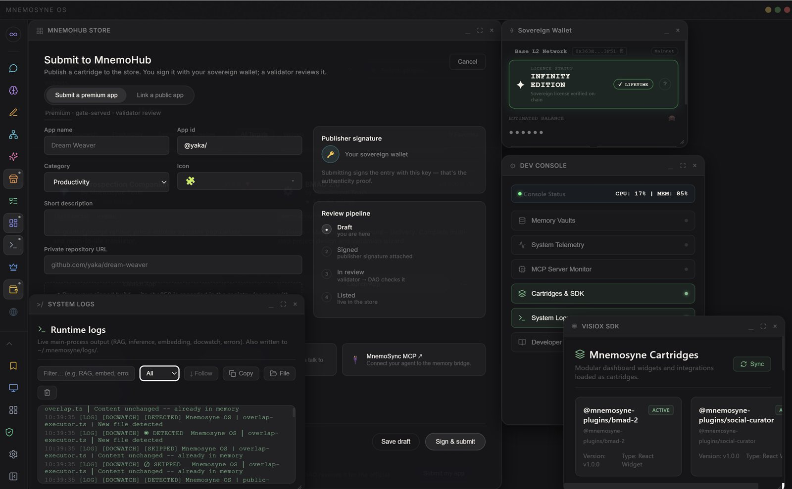

 

 

# Mnemosyne OS

### A sovereign memory operating system — for people, not agents.

 

*Everyone is building the intelligence.*
*We build the **relationship** — the memory that makes an AI actually know you,*
*across sessions and across years. On your machine. Yours to read.*

 

 

 

---

## Not another agent-memory library

Mem0, Zep and Letta hand *an agent* a memory service you wire into a cloud stack. The
customer is the infrastructure.

**Mnemosyne OS is a desktop application, and the customer is you.** It installs on your
machine, reads the files and conversations you point it at, and keeps them as durable,
searchable memory that any model you connect can draw on. Nothing is uploaded to run it.
A human — not a heuristic — decides what is remembered, what is surfaced, and what is
forgotten.

If you were looking for the spaced-repetition flashcard app, or for a Python package that
gives an agent a recall API, this is neither.

---

## What it actually does

| | |
|---|---|
| 🗄️ **Vaults** | Memory partitioned by domain — code, notes, research, journal. Nothing bleeds between them unless you say so. |
| 📜 **Chronicles** | Every memory keeps its kind and its context, so retrieval returns *why* something mattered, not just a matching string. |
| 🌐 **Neural map** | Your memory as a navigable topology — see what connects to what, instead of trusting a black box. |
| 🌙 **Consolidation** | A dream state that revisits old material while you are away, and writes down what it noticed. |
| 🎙️ **Voice** | Local speech in and out, dispatched to real GPU or CPU so a heavy model never freezes the app. |
| 🧩 **Cartridges** | Small apps that live inside the OS and share its memory — a reader, a translator, a restaurant book. Build your own. |

 

  

---

## A number you do not have to take on faith

Mnemosyne OS scores **72.9% on LongMemEval-M**.

Anyone can publish a percentage. We publish the ledger underneath it: every question,
every retrieved chunk, every judgement — plus a script that re-derives the score from
those raw results in front of you.

**[→ Open the verification kit](https://mnemosyne-os.github.io/MnemosyneOS---benchmarks/verification-kit/)**

If a memory system quotes you a benchmark without shipping the run behind it, ask why.

---

## Get it

| Platform | Build |
|---|---|
| **Windows** | Installer or portable `.exe`, x64 |
| **macOS** | `.dmg`, Apple Silicon |
| **Linux** | `.deb` · `.AppImage`, x86_64 |

**[→ Download Infinity Edition v1.3.5](https://github.com/Mnemosyne-OS/Mnemosyne-Neural-OS/releases/latest)**

---

## In this organization

| Repository | What it holds |
|---|---|
| **[Mnemosyne-Neural-OS](https://github.com/Mnemosyne-OS/Mnemosyne-Neural-OS)** | Documentation, the MnemoForge CLI, the developer SDKs, and every release of the desktop app. |

Open to build on, private at the core: the surfaces you extend are open, the memory
engine is not.

---

**[mnemosyne-os.io](https://mnemosyne-os.io)** · **[mnemosyne-os.com](https://mnemosyne-os.com)**

Memory perceives, situates and reveals. The human governs.

