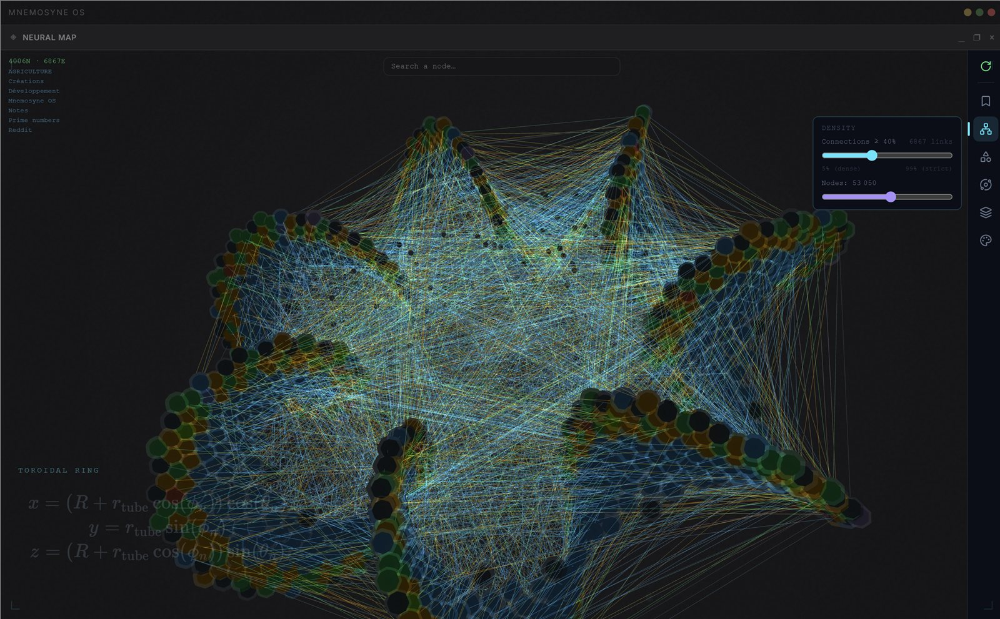
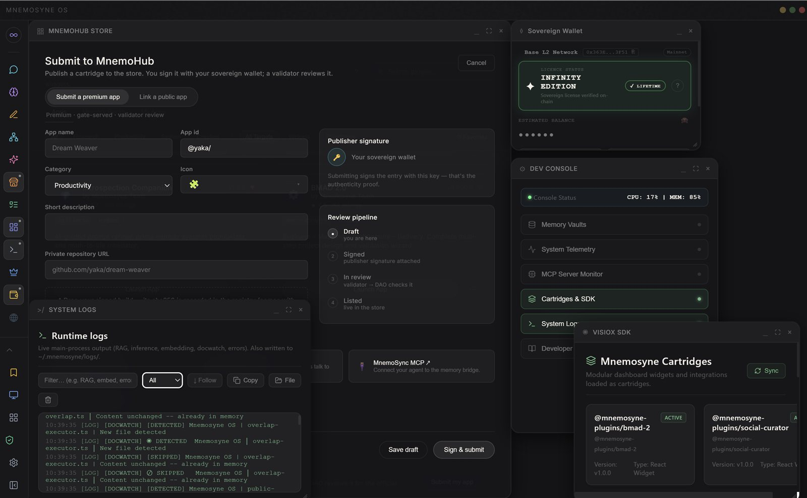
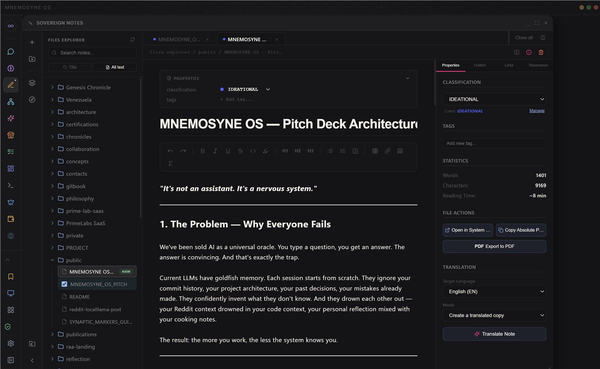

  

 

<h2></h2>

Mnemosyne OS is an AI assistant that remembers you. It runs on your own machine.

It reads only the folders you choose to open to it, and keeps them as memory any model
you connect can draw on. Six months later it still knows your projects, your decisions
and your sources. Over time it learns how you work and adapts to you.

It is also the control room for your AI agents. Your coding agents show up as cards on
your desktop, your assistant answers you on Telegram, and nothing risky runs without
your approval.

 

 

<h2></h2>

Every AI company is building the intelligence. We are building the relationship: an
assistant that knows a person, stays with them and helps with each of their projects.

The relationship has two halves.

**Memory, the half we have built and measured.** Your files and conversations become
memory, organised into vaults, retrieved by meaning and by exact words, with the
sources shown. This half has a benchmark, and every verdict is published (section 07).

**The way of being with a human, the half we are researching.** A relationship also
depends on how the assistant answers. Mnemosyne OS pushes back on your ideas and your
projects, like a partner who challenges you. One user told us its answers unsettled
her, in a good way. A memory benchmark cannot measure this half, so we study it
differently: from the conversations people choose to share with us.

If its way of answering surprised you, we want to read about it:
[dev@mnemosyne-os.io](mailto:dev@mnemosyne-os.io).

**[→ Why the relationship layer](https://github.com/Mnemosyne-OS/Mnemosyne-Neural-OS/blob/main/doc/WHY.md)**

<h2></h2>

| | |
|---|---|
| 🛩️ **A control room for your agents** | Your coding agents appear as cards on your desktop, through [herdr](https://github.com/herdrdev/herdr). You see which one is working and which one waits, and you reply from its card. Hermes Agent installs in one click and answers you on Telegram. |
| 🖐️ **JARVIS mode** | You talk to the orb and it runs your commands. Through your webcam, you move windows with your hands (beta). With a local model, everything runs on your machine and costs $0 in tokens. |
| 🧑‍💻 **Developers** | Connect your memory to Claude Code, Cursor or any MCP client. Your agents start with your code, your decisions and your notes. |
| 🎓 **Students** | Import a course as a PDF, a Word file or a photo. Melete turns it into a mind map, flashcards and a quiz. |
| 🔬 **Researchers** | Every answer cites its sources, and a second pass checks each sentence against them. |
| ⚖️ **Lawyers** | Cut the internet and question your case files with the best local models. Nothing leaves your machine. |
| 🕸️ **Several machines** | Pair your computers on your local network, see every machine's agents on one desktop, and give each computer a role. |

Mnemosyne OS runs from 8 GB of RAM on Windows, macOS and Linux, and adapts to your
hardware at install time. With 40 GB of RAM you can run everything locally, with the
largest models.

<h2></h2>

A memory cartridge fetches public knowledge from its official source and stores it in
your memory. You choose the source and the size, then you question it from the chat
like your own notes. Every text keeps its source, its date and its licence.

| Cartridge | What it brings into your memory |
|---|---|
| ⚖️ **[MnemoLaw](https://github.com/Mnemosyne-OS/MnemoLaw)** | The laws of your city or your country: US city codes, national codes, EU regulations and international treaties, quoted word for word. |
| 🩺 **MnemoHealth** | Medical texts from public sources: rare diseases (Orphanet), mental health (NIMH), WHO fact sheets and open-access research articles. |
| 🔭 **MnemoScience** | Textbooks and science texts by field: physics, chemistry, biology, mathematics, astronomy and the history of science. |
| 🕰️ **MnemoClio** | The history of 197 countries on a timeline you can move, from five centuries down to five years. |
| 🛡️ **MnemoVulns** | Known vulnerabilities in your projects' dependencies, each with the version that fixes it. |
| ™️ **MnemoMarks** | Trademark registers on your machine. Before you name your project, check the marks already registered. |

These are the first memory cartridges. Many more are on the way.

<h2></h2>

**The OS**

| Repository | What lives there |
|---|---|
| 💿 **[Mnemosyne-Neural-OS](https://github.com/Mnemosyne-OS/Mnemosyne-Neural-OS)** | The desktop app: documentation, the MnemoForge CLI, the developer SDKs, and every signed release for the three platforms. |
| 🌐 **[mnemosyne-os.github.io](https://github.com/Mnemosyne-OS/mnemosyne-os.github.io)** | The organization on GitHub Pages. |
| 📄 **[.github](https://github.com/Mnemosyne-OS/.github)** | This page, and the generator that draws it. |

**Memory cartridges**

| Repository | What lives there |
|---|---|
| ⚖️ **[MnemoLaw](https://github.com/Mnemosyne-OS/MnemoLaw)** | The laws of your city or your country, quoted word for word in the chat. |

**Cartridges: apps that run inside the OS and share its memory**

| Repository | What lives there |
|---|---|
| 🤖 **[MnemoHermes](https://github.com/Mnemosyne-OS/MnemoHermes)** | A cockpit for Hermes Agent: watch it, talk to it, keep or reject every memory it writes. |
| 🧵 **[Ariadne](https://github.com/Mnemosyne-OS/Ariadne)** | Browse what your coding agents wrote, and keep the drafts worth keeping. |
| 🎓 **[Melete](https://github.com/Mnemosyne-OS/Melete)** | A course becomes a mind map, flashcards and a quiz. |
| 🌌 **[MnemoCosmos](https://github.com/Mnemosyne-OS/MnemoCosmos)** | An offline sky atlas wired to your memory. |
| 🧪 **[MnemoMolecule](https://github.com/Mnemosyne-OS/MnemoMolecule)** | Molecular structures in 3D, and what your own notes say about them. |
| 🫀 **[MnemoAtlas](https://github.com/Mnemosyne-OS/MnemoAtlas)** | An interactive 3D atlas of the human body, offline. |
| 📚 **[MnemoReader](https://github.com/Mnemosyne-OS/MnemoReader---MnemosyneOS)** | A PDF library that reads itself aloud. |
| 🏠 **[Oikos](https://github.com/Mnemosyne-OS/Oikos)** | Your Home Assistant, read into your memory. |
| 🏝️ **[MnemoArchipel](https://github.com/Mnemosyne-OS/MnemoArchipel---Mnemosyne-OS)** | A personal CRM for the people in your life. |
| 🍽️ **[MnemoResto](https://github.com/Mnemosyne-OS/MnemoResto---MnemosyneOS)** | The restaurant that forgets no guest. |
| 📣 **[Pheme](https://github.com/Mnemosyne-OS/Pheme)** | A reputation coach for Reddit and Hacker News that never posts. |
| ✨ **[Muse](https://github.com/Mnemosyne-OS/Muse)** | Describe an app, get a real project on disk. |
| 🌍 **[Translator](https://github.com/Mnemosyne-OS/mnemosyne_OS-translator)** | Batch translation under your own key. |
| 🗺️ **[BMAD](https://github.com/Mnemosyne-OS/mnemosyne_OS-bmad)** | An idea turned into a project blueprint. |

**For your coding agents**

| Repository | What lives there |
|---|---|
| 🧷 **[agent-memory-skill](https://github.com/Mnemosyne-OS/agent-memory-skill)** | A Claude Code skill that indexes your agent's memory folder into a vault. |
| 🧰 **[mnemosyne-skills](https://github.com/Mnemosyne-OS/mnemosyne-skills)** | The Claude Code skills we use to build Mnemosyne OS. |
| 👁️ **[mnemosyne-agents-for-humans](https://github.com/Mnemosyne-OS/mnemosyne-agents-for-humans)** | Watcher: an agent that tells you what your other coding agents did. |

**The proof**

| Repository | What lives there |
|---|---|
| 🔬 **[MnemosyneOS---benchmarks](https://github.com/Mnemosyne-OS/MnemosyneOS---benchmarks)** | Every benchmark campaign published whole: methodology, per-question verdicts, raw logs, and a kit that re-derives each score. CC BY 4.0. |

The surfaces you extend are open. The memory engine is sealed.

<h2></h2>

Psyche gives your AI a persistent personality: character, voice and identity, forged by
you in a guided ritual and carried across conversations and across models. Psyche ships
inside Mnemosyne OS today.

**[→ psyche.mnemosyne-os.io](https://psyche.mnemosyne-os.io)**

<h2></h2>

Mnemosyne OS scores **77.1% on LongMemEval-M**, full-haystack, around 480 distractor
sessions per question, on 48 holdout questions never used to tune the engine. The official
LongMemEval judge graded it, and the protocol was published before the run. On the
48 questions used to tune the engine, the strict judge gives **85.4%**.

These scores come from the hybrid mode: embeddings and search ran locally, and a
cloud model, gemini-3.8-flash, wrote the answers. Mnemosyne OS also runs fully
local, with a model on your machine.

In September an outside audit found a wrong verdict in our August result. We
published an erratum and ran the whole benchmark again.
[The full account, in the repository README](https://github.com/Mnemosyne-OS/Mnemosyne-Neural-OS#proven-on-longmemeval-m-not-just-a-pitch).

**[→ Open the verification kit](https://mnemosyne-os.github.io/MnemosyneOS---benchmarks/verification-kit/)**

<h2></h2>

Research is published whole, with permanent identifiers, including the hypotheses that
failed.

| Publication | |
|---|---|
| **The Resonance Engine**: *a multi-engine cognitive memory architecture for sovereign AI systems.* Whitepaper v2.1, CC BY 4.0. |  |
| **LongMemEval-M full-haystack verification kit**: *per-question ledgers and audit scripts.* CC BY 4.0 and MIT. |  |
| **Lab notes**: what we measured, and what was wrong. |  |
| **Author record**: the ORCID behind the deposits. |  |

<h2></h2>

Published by **XPACEGEMS LLC**. These are its official addresses.

| | |
|---|---|
| **Product** | [mnemosyne-os.io](https://mnemosyne-os.io) |
| **Company, press and labs** | [mnemosyne-os.com](https://mnemosyne-os.com) |
| **Documentation** | [docs.mnemosyne-os.io](https://docs.mnemosyne-os.io) |
| **Soul engine** | [psyche.mnemosyne-os.io](https://psyche.mnemosyne-os.io) |
| **Source and releases** | this organization |
| **Packages** | the npm scope `@mnemosyne_os`, [the list](https://mnemosyne-os.io/packages) |
| **Contact** | [dev@mnemosyne-os.io](mailto:dev@mnemosyne-os.io) |

 

 

**[mnemosyne-os.io](https://mnemosyne-os.io)** · **[psyche.mnemosyne-os.io](https://psyche.mnemosyne-os.io)** · **[mnemosyne-os.com](https://mnemosyne-os.com)** · **[docs.mnemosyne-os.io](https://docs.mnemosyne-os.io)**

